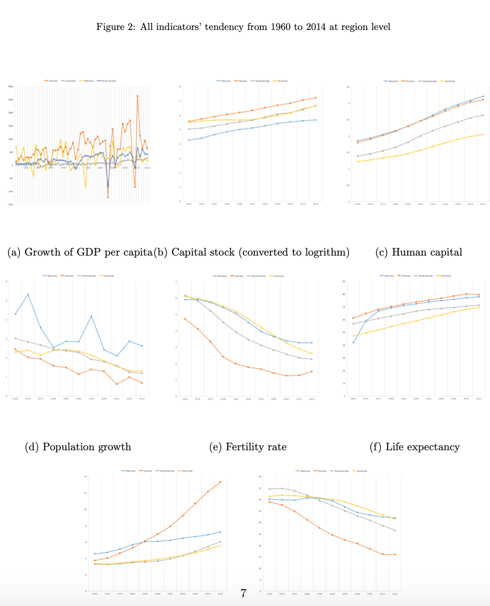

# Demographic_Economics_Project
Older? Richer? A Study of the Relationship between Population Aging and Economic Growth in Asia -- Jul 2016 – Dec 2016

## Goal: 
To find the relationship between GDP per capita and other demographic variables
## Data: 
Time series panel data  from Penn tables  and World Bank

## Project description
 ### Purpose :
 To figure out how the population aging affects economic growth in Asia 
 ### Methodology :
       - Used Econometrics methods to set up a model for the panel data
       - Used R to test data via pooled effects model, fixed effects model, and random effects model, then comparing them via      Lagrange Multiplier test, F-test, and Hauseman test
### EDA

### Modeling
- Pooled OLS
- Random Effects
- Fixed Effects
### Conclusion
Population aging is a challenge of Asia. According to the results of this paper, considerable demographic transformation has been restrained the eco- nomic growth from 1960 to 2014. Based on the projection of Lutz, Sanderson and Scherbov (2007)[26] , the issues of population aging will become increas- ingly serious by 2050. With significant and pervasive social, economic and political implications, planning for the future merits priority consideration of the aging of societies. The the elderly (age 65+) in Asia is estimated to increase rapidly, being 6.38 millions in 1960, almost 901 millions in 2050, and 1.22 billion by 2100[14]. The estimated ratio of the old population to total population in 2050 is greater than that of Japan in 2010 (23%). Indeed, in Japan, along with China and other countries in East Asia, approximately 30% of the population is expected to be over the age of 65 years by 2050. The factors that we discussed in section 6 related to population aging show challenges to governments and relative departments across Asia. The propos- als for governments are to empower the elderly and promote their rights in order to increase participation rate in social, economic and other fields, and to rigorously enact relevant laws to not only control the population growth but also enhance the needs of older persons. Appropriate policies and laws are required to meet the needs of the elderly, and the society wide ramifica- tions of an aging population and the requisite socio-economic adjustments to accommodate transition to an aging society.
